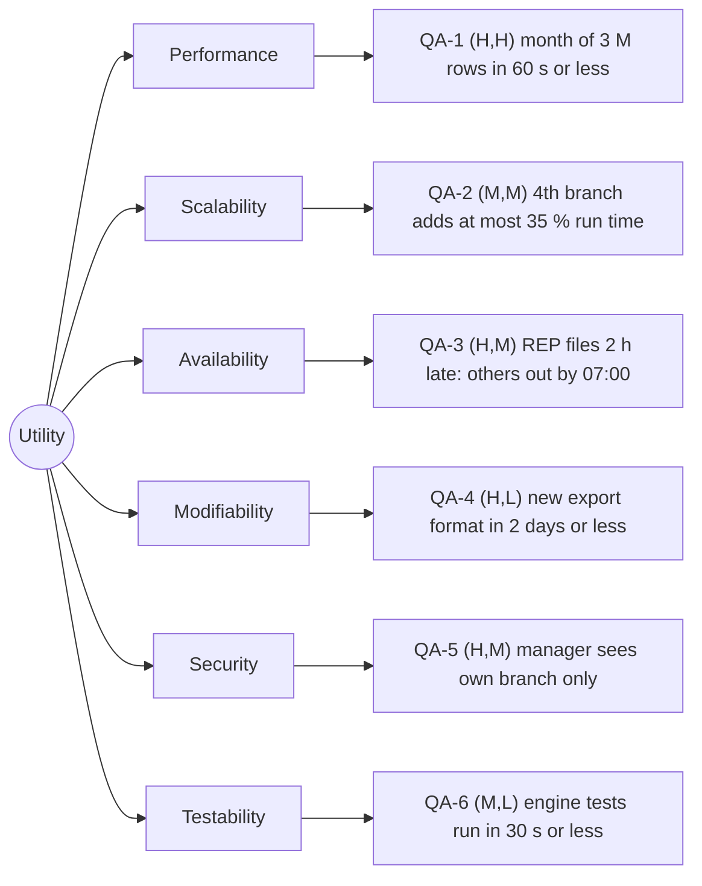

# Quality-attribute scenarios: Angkor Mart monthly sales report

## Stakeholders
- Head-office analyst: needs the full chains report on the morning of the 2 days and must be able to trust the total
- Branch manager (PNH, REP, BTB): read only their own branch report
- Finance director: get the "ready" email and the report before the morning meeting
- Operations person: starts and watches the 06:00 run; must see at once which branch file is missing
- Developers: adding features such a new export formats and need fast, reliable tests.

## Scenarios
| ID | Attribute | Source | Stimulus | Artifact | Environment | Response | Response measure | Rank |
|----|-----------|--------|----------|----------|-------------|----------|------------------|------|
| QA-1 | Performance | Scheduler, 06:00 on day 2 of M+1 | Starts the report for a month of about 3 M rows | Report engine | Normal operation, 8-core server, files complete | Report files written, "ready" event published | <= 60 s wall-clock, median of 5 runs after 2 warm-up runs | (H,H) |
| QA-2 | Scalability | Head office, opening the 4th branch | Adds the branch files, so the month grows from 3 M to 4 M rows | Report engine and branch configuration | Normal operation, same 8 core server | all 4 branch is reported only the configuration is added | Run time <= 81s (1.85 x the 60 s of QA-1) median of 5 runtime after 2 warm-up runs; 0 soruce files changed | (M,M) |
| QA-3 | Availability | REP network link (link failiure) | REP's files for the month arrive 2h late | Scheduler and report engine | Normal operation at 06:00 on day 2 | PNH are published at once; REP is marked as "pending"; REP and report chains are produced automatically when it arrived | PNH and BTB publish by 07:00 in 10 of 10 fault-injection run (REP files withelds); REP report <= 10 mins after last file arrives, read from log timestamp | (H,M) |
| QA-4 | Modifiability | 	Developer, after a client request | A new export format (for example XLSX) is requested next to the existing ones | Render module | Design time, existing code base | New renderer is added behind the renderer interface; aggregation code is untouched | <= 2 person-days, <= 3 files changed, <= 150 lines changed, 0 files changed in the aggregation package (git diff --stat) | (H,L) |
| QA-5 | Security | PNH branch manager, logged in | Asks for the REP report by changing the branch id in the request | Report access layer | Normal operation | Request is refused, no REP data is returned, the attempt is logged | 0 rows of another branch returned in 60 of 60 attempts (3 managers x 2 other branches x 10 report files); audit entry <= 1 s after each refusal | (H,M) |
| QA-6 | Testability | Developer or CI server | Runs the engine tests after a code change | Aggregation logic of the engine | Developer laptop, no network, no database, 10 000-row fixture | Tests run and compare results with totals computed by hand | Suite <= 30 s wall-clock, median of 5 runs after 2 warm-up runs; >= 80 % line coverage of the aggregation code | (M,L) |

## Rank justifications
- QA-1 (H,H): the report is due in the morning and 3 M rows with BigDecimal arithmetic in 60 s forces a streaming and parallel design from the first line of code.
- QA-2 (M,M): a 4th branch is possible but not planned, and linear scaling already meets the target, so only hard-coded branch lists must be avoided.
- QA-3 (H,M): the finance director must not lose two good branches because one link failed, which needs per-branch processing and an automatic re-run.
- QA-4 (H,L): the client will ask for formats again and again, and a renderer interface makes each one cheap.
- QA-5 (H,M): branch figures are sensitive and "own branch only" is an explicit client rule, so the check must sit in one access layer that no request bypasses.
- QA-6 (M,L): fast tests mainly help the team, and a pure aggregation function without I/O is easy to test.

## Assumptions
- A1: the report server has 8 cores and an SSD (to confirm with the client).
- A2: the month has about 3 000 000 rows split equally over 3 branches, so 3 000 000 / 3 = 1 000 000 rows per branch (to confirm).
- A3: QA-1 needs 3 000 000 / 60 = 50 000 rows/s overall, which is 50 000 / 8 = 6 250 rows/s per core when work is spread evenly.
- A4: a 4th branch has the same volume, so the month becomes 4 x 1 000 000 = 4 000 000 rows, an increase of 4 / 3 = 1.333 (33.3 %). Linear scaling gives 60 x 1.333 = 80 s; the limit 60 x 1.35 = 81 s leaves 1 s of margin.
- A5: "all files present" means every daily CSV of the month (for example data/2026-09/PNH-2026-09-01.csv) is in place before 06:00.
- A6: in QA-3 the late files arrive at 08:00 (2 h late); PNH and BTB take about 60 s from 06:00, so 07:00 is 60 min of margin. The 10 min limit for the REP re-run is our own target (to confirm).
- A7: each manager account is linked to exactly one branch, and users are authenticated before any request.
- A8: the 10 000-row test fixture is small enough to run without a file server or database.

## Utility tree

## Architectural drivers
QA-1 (H,H), QA-3 (H,M), QA-5 (H,M)